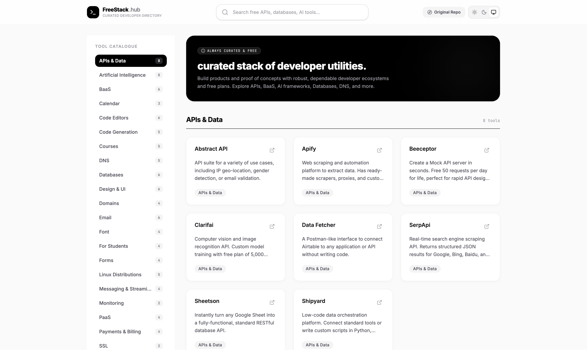

# 💸 FreeStack Hub



A beautiful, production-ready, and highly polished curated directory listing free developer tools across 21 core categories. Built with **React**, **Vite**, **Tailwind CSS (v4)**, and **Fuse.js** for real-time fuzzy filtering.

---

## 🚀 Key Features

- **Categorized Indexing**: Sleek left category navigation providing instant smooth scrolling anchors.
- **Micro-interactions**: Subtle cards lifting, hover external link states, and interactive toggles.
- **Fuzzy Search Engine**: Real-time fuzzy filtering utilizing `Fuse.js` with an automated clustering system.
- **Smart Active Tracking**: Dynamic sidebar selection highlighting categories perfectly synced to scroll positions.
- **Multi-Theme Engine**: LocalStorage persistent dark/light mode context.
- **Collapsible Drawer on Mobile**: Fully responsive mobile-tailored sidebar menu toggle.

---

## 🛠️ Installation & Setup

Ensure you have [Node.js](https://nodejs.org) installed on your system.

### 1. Install Dependencies

```bash
npm install
```

### 2. Run Desktop Development Server

```bash
npm run dev
```

The server boot up on port `3000` (http://localhost:3000).

### 3. Production Compilation Action

```bash
npm run build
```

This builds optimized client assets and places them inside the `/dist` output folder.

### 4. Code Quality Validation

```bash
npm run lint
```

Checks TypeScript schemas for correctness without emitting files.

---

## ☁️ Deployment Instructions

### Deploy to Netlify

To deploy **FreeStack Hub** on Netlify, connect your repository and configure the following parameters:

- **Build Command**: `npm run build`
- **Publish Directory**: `dist`
- **Node Version**: `18+` or `20+`

---

## 📁 File Structure

```text
/
├── postcss.config.js       # CSS pipeline helper options
├── tailwind.config.js      # Theme aliases configuration mapping
├── vite.config.ts          # Vite compilation overrides
├── index.html              # HTML structure + Inter font resources
├── metadata.json           # Application platform identifier
├── src/
│   ├── main.tsx            # App bundle mounting entrypoint
│   ├── App.tsx             # Master layout of categories & stats hooks
│   ├── index.css           # Tailwind v4 import registers
│   ├── data/
│   │   └── resources.json  # Full database of 21 developer categories
│   └── components/
│       ├── Sidebar.jsx           # Section tracker list drawer
│       ├── SearchBar.jsx         # Fuse.js search query logic
│       ├── CategorySection.jsx   # Nested category header and blocks
│       ├── ItemCard.jsx          # Individual tool cards
│       ├── DarkModeToggle.jsx    # Dual theme sun/moon switcher
│       └── ErrorBoundary.tsx     # Full safety layout protection
```

---

_Curated with ❤️ for developers._
